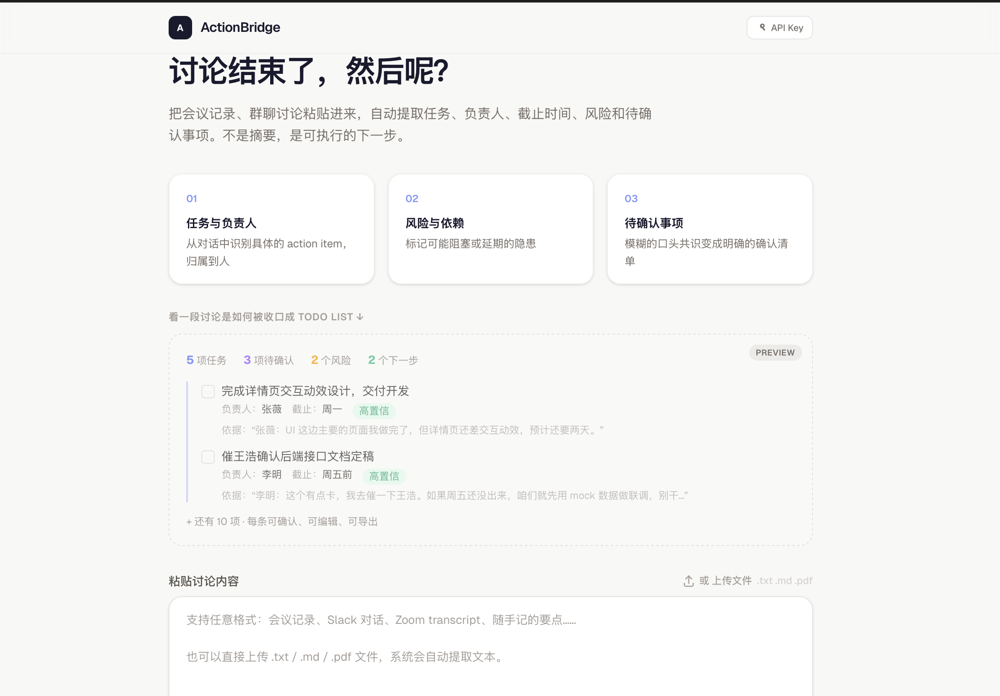
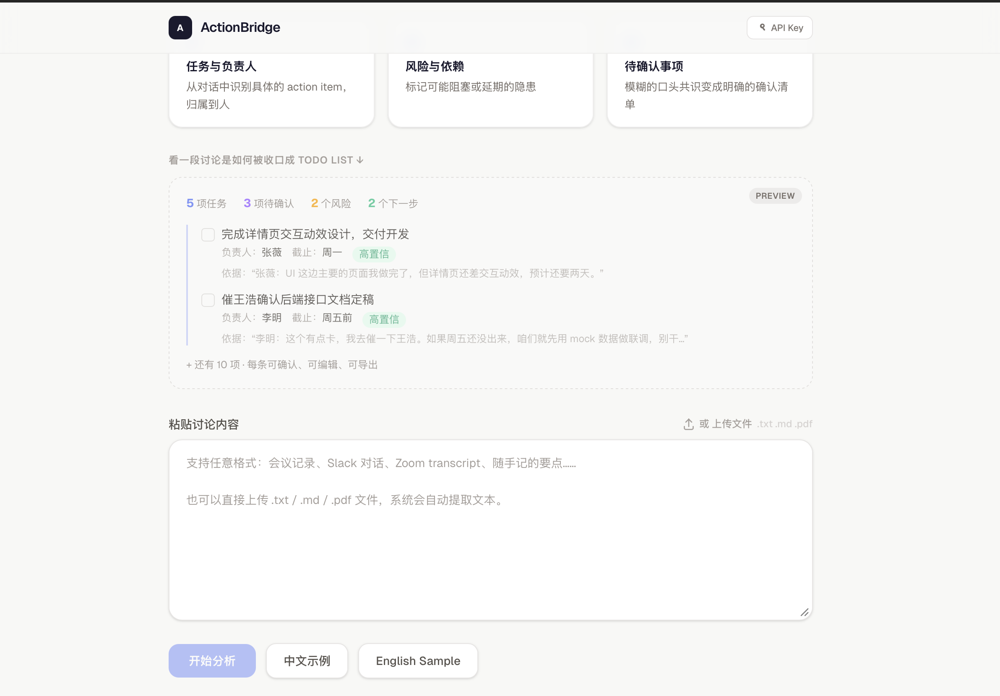
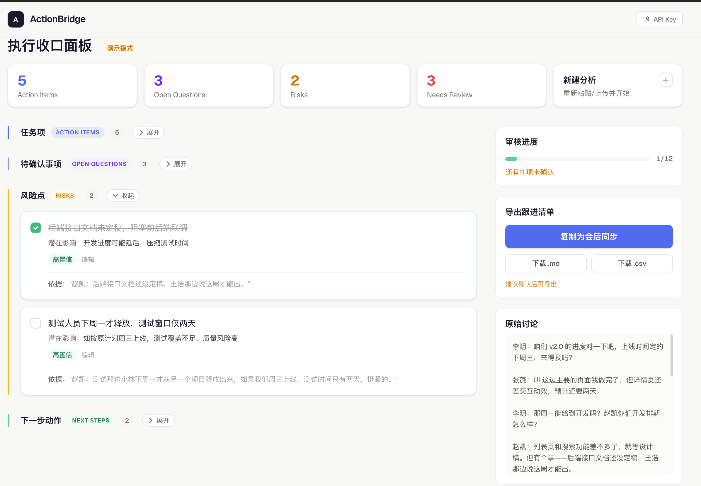

<div align="center">

# ActionBridge

**Turn messy team discussions into executable follow-up.**

AI-powered execution closure assistant for small teams.

[Live Demo](https://actionbridge-ai-powered-production.up.railway.app) · [GitHub Repo](https://github.com/theAtlantic-zza/ActionBridge-AI-Powered) · [Example Workflow](#example-workflow--示例工作流) · [Schema](#extraction-schema--结构化输出-schema) · [Quick Start](#quick-start--快速开始)


</div>

---

## Why ActionBridge? / 为什么做这个项目？

> **Meetings end. Execution doesn't start.**

Every team has this problem: after a discussion, everyone *thinks* they know what was agreed. But in reality — tasks go unassigned, deadlines stay vague, risks get mentioned and forgotten, and a week later someone says *"I thought you were handling that."*

ActionBridge closes this gap.

> **会开完了，执行没开始。**
>
> 每个团队都有这个问题：讨论结束后，大家觉得自己听懂了，但实际上——任务没分配、截止没确认、风险提了就忘、一周后才发现"我以为你在做"。
>
> ActionBridge 解决的就是这个断层。

**This is NOT:**
- ❌ A meeting summarizer / 会议摘要工具
- ❌ A note-taking app / 笔记工具
- ❌ A collaboration platform / 协同平台

**This Is:**
- ✅ An execution closure assistant / 执行收口助手
- ✅ The step between "we talked about it" and "we're actually doing it"

---

## Screenshots / 界面预览

| Overview / 首页预览 | Input / 输入与上传 | Result / 执行收口面板 |
|---|---|---|
|  |  |  |

> *One flow, three moments:* **Paste or upload** discussion → **Extract** actionable follow-ups → **Review & export** a checklist your team can execute.
>
> *一条主线，三步到位：* **粘贴/上传**讨论 → **提取**可执行清单 → **审核并导出**会后跟进。

---

## Example Workflow / 示例工作流

ActionBridge is not a summary tool. It’s a **post-discussion execution closure loop**: turn messy talk into **assignable, reviewable follow-up**.

ActionBridge 不是摘要工具，而是 **讨论之后的执行收口闭环**：把“聊完了”变成“可以分派、可以核对、可以导出跟进”的清单。

### 1) Discussion snippet / 一段真实感讨论片段

```text
李明：这周 v2.0 的上线要定了，周三能上吗？
张薇：UI 主流程没问题，但详情页还差交互动效，估计还要两天。
赵凯：测试同学下周才释放，测试窗口可能只有两天，风险有点高。
李明：那详情页动效先降级？如果不影响主流程就先上。
张薇：可以，我今晚出个降级方案，明天给你确认。
赵凯：那我也补一个回归测试清单，周一先跑一轮。
```

### 2) Structured output / 结构化输出（可编辑 + 有依据）

#### Action Items / 任务项
- **[A-1]** 输出「详情页动效降级方案」并评审  
  - **owner**: 张薇 · **dueDate**: 明天  
  - **evidence**: “我今晚出个降级方案，明天给你确认。”  
  - **confidence**: high · **needsReview**: false
- **[A-2]** 补齐回归测试清单并在周一先跑一轮  
  - **owner**: 赵凯 · **dueDate**: 周一  
  - **evidence**: “我也补一个回归测试清单，周一先跑一轮。”  
  - **confidence**: high · **needsReview**: false

#### Open Questions / 待确认事项
- **[Q-1]** v2.0 是否按「主流程优先 + 详情页动效降级」策略在周三上线？  
  - **evidence**: “周三能上吗？” / “那详情页动效先降级？…就先上。”  
  - **confidence**: medium · **needsReview**: true

#### Risks / 风险点
- **[R-1]** 测试窗口过短（仅两天）可能导致回归覆盖不足  
  - **evidence**: “测试窗口可能只有两天，风险有点高。”  
  - **confidence**: high · **needsReview**: false

#### Next Steps / 下一步动作（建议）
- **[N-1]** 明天确认降级方案后，冻结上线范围并同步到群公告  
  - **owner**: 李明（建议） · **priority**: high  
  - **evidence**: “明天给你确认。” / “周三能上吗？”  
  - **confidence**: medium · **needsReview**: true

> The point is not “what was said” but “what must happen next”.  
> 重点不是“总结讨论内容”，而是“把讨论收口成下一步必须执行的动作”。

---

## Validation & Iteration / 用户反馈与迭代

This project was iterated based on real usage friction — not built in a vacuum:

- **“像脚本，不像产品”** → 首页加入结果预览 + 结果页升级为两栏工作台（对照原文、审核、导出）
- **“输入门槛高”** → 支持 `.txt/.md/.pdf` 导入；PDF 无文本层时提供 OCR 兜底（并明确成本/隐私提示）
- **“不信 AI”** → 每条结果默认展示 evidence，并用 needs review / 置信度把不确定性暴露出来
- **“闭环不顺”** → 导出区常驻侧栏，导出前提醒未确认项；“新建分析”从主动作降级到更合适位置

---

## Why no voice / real-time transcription / 为什么不做语音与实时转写

Not because it’s technically hard — but because it **changes the product’s center of gravity**.

- **This product focuses on post-discussion execution closure**: review, evidence, confirmation, export.
- **Real-time transcription shifts priority to content capture** (latency, speaker diarization, meeting integrations, storage & privacy), which is a different product.
- For this portfolio MVP, the highest ROI is tightening the closure loop via **file input → structured extraction → human review → export**.

---

## Extraction Schema / 结构化输出 Schema

ActionBridge asks the model for a fixed, reviewable structure. The UI is built around **explicit missing fields** (no guessing).

### Conceptual schema (product view)

Each item includes:
- `id`
- `text`
- `evidence` (source excerpt)
- `confidence` (`high` / `medium` / `low`)
- `needsReview` (true when uncertain or incomplete)

`ActionItem` additionally includes:
- `owner` (nullable)
- `dueDate` (nullable)

### Implementation schema (repo)

The code uses a closely aligned TypeScript shape:

```ts
type Confidence = "high" | "medium" | "low";

type BaseItem = {
  id: string;
  description: string;   // text
  sourceExcerpt: string; // evidence
  confidence: Confidence;
  confirmed: boolean;    // confirmed === !needsReview
};

type TaskItem = BaseItem & { owner: string | null; deadline: string | null };
type ConfirmationItem = BaseItem & { relatedTo: string | null };
type RiskItem = BaseItem & { impact: string };
type NextStepItem = BaseItem & { owner: string | null; priority: "high" | "medium" | "low" };
```

**Design constraint:** missing `owner/deadline` stays explicit (e.g. `"待指定"` in UI) instead of being guessed.

---

## Features / 功能亮点

### 📋 Structured Extraction / 结构化提取

Paste meeting notes, Slack threads, Zoom transcripts, or rough bullet points. AI extracts:

- **Action Items** — tasks with owners and deadlines
- **Open Questions** — things agreed but not formally confirmed
- **Risks** — blockers and dependencies that could derail progress
- **Next Steps** — recommended immediate actions

每条提取结果都有原文依据、置信度标记和负责人归属。

### 🔍 Evidence-Based / 有据可查

Every extracted item cites the original discussion text. Users can verify each item traces back to what was actually said — not what the AI guessed.

每条结果都附有来源原文，不是 AI 瞎编，可以逐条回溯验证。

### 🤝 Human-in-the-Loop / 人机协作

AI proposes, humans decide.

- **Confidence marking** — High / Medium / Low indicators surface uncertainty
- **"待指定" indicators** — when AI can't determine an owner or deadline, it says so explicitly
- **Inline editing** — every field is editable
- **Confirm checkbox** — check off items you've reviewed and agreed with
- **Review hints** — export area warns about unconfirmed items or missing owners

AI 负责提取，你负责拍板。低置信度条目明确标注"需人工确认"，缺失字段显示"待指定"，导出前提醒未完成的审核项。

### 📤 Export & Share / 导出与共享

- **Copy for team sync** — one click, paste directly into group chat or email
- **Download .md** — clean Markdown follow-up checklist
- **Download .csv** — task table for spreadsheets or project tools

导出内容格式专业，适合直接发群或发邮件作为会后跟进清单。

### 🔑 BYOK / 自带密钥

Click the API Key button in the header to connect your own OpenAI-compatible model. Key is stored in browser localStorage only — never sent to any server for storage.

Without a key, the app runs in **mock mode** with realistic demo data. The demo flow is identical to the real flow.

支持在浏览器内直接输入 API Key，兼容 OpenAI / DeepSeek 等服务。不输入则使用演示数据，体验完全一致。

---

## Quick Start / 快速开始

### Option 1: Try the Live Demo

Visit the [Live Demo](https://actionbridge-ai-powered-production.up.railway.app) — no setup needed. Click **中文示例** or **English Sample** to see it in action.

### Option 2: Run Locally

```bash
git clone https://github.com/theAtlantic-zza/ActionBridge-AI-Powered.git
cd ActionBridge-AI-Powered
npm install
npm run dev
```

Open [http://localhost:3000](http://localhost:3000).

### Connect an AI Model / 连接 AI 模型

**In-browser:** Click the 🔑 **API Key** button in the top-right corner.

**Via environment variable:** Create `.env.local`:

```env
OPENAI_API_KEY=sk-your-key
OPENAI_BASE_URL=https://api.openai.com/v1
OPENAI_MODEL=gpt-5.4-pro
```

Any OpenAI-compatible API works:

| Provider | Notes |
|---|---|
| OpenAI | GPT-5.4 Pro recommended |
| DeepSeek | Cost-effective alternative |
| Any compatible | Custom `OPENAI_BASE_URL` |

---

## Design Decisions / 设计决策

These are intentional product choices, not shortcuts:

| Decision | Why / 为什么 |
|---|---|
| **Evidence on every item** | Each item cites original text. Users verify — not blindly trust. / 每条结果附原文依据，用户验证而非盲信 |
| **Confidence marking** | Surface what AI is uncertain about. / 暴露 AI 不确定的地方 |
| **Human-in-the-loop** | AI proposes, humans decide. Checkbox = "I reviewed this." / AI 提议，人拍板 |
| **Explicit placeholder for missing fields** | When an owner/deadline can't be determined, the UI shows a clear placeholder (e.g. "待指定") instead of guessing. / AI 承认不知道，而非瞎猜 |
| **Review hints before export** | Nudge users to complete review before sharing. / 引导用户确认后再发出 |
| **No history, no accounts** | Single-use by design. Paste, analyze, export, done. / 刻意不做，保持简单 |
| **Mock mode** | Demo and real flow are identical. / 演示和真实体验完全一致 |

---

## Architecture / 架构

```
Input Phase ──→ Analyzing Phase ──→ Result Phase
(paste text)    (AI extraction)     (review, edit, confirm, export)
     │                │                    │
     ▼                ▼                    ▼
 input-view      analyzing-view       result-view
                      │               ├── result-section (×4, color-coded)
                      ▼               ├── result-item (editable cards)
                 API Route            └── export toolbar
                 ├── User API Key
                 ├── Env API Key
                 └── Mock fallback
```

## Tech Stack / 技术栈

| Layer | Tech |
|---|---|
| Framework | Next.js 16 (App Router) |
| Language | TypeScript (strict) |
| Styling | Tailwind CSS v4 |
| UI | React 19, hand-built components |
| AI | OpenAI-compatible API + structured JSON output |
| Export | Markdown, CSV |
| Deployment | Railway |

## Project Structure / 项目结构

```
src/
├── app/
│   ├── api/analyze/route.ts   → Analysis endpoint (LLM + mock fallback)
│   ├── page.tsx               → Single-page phase orchestrator
│   └── layout.tsx             → Root layout and metadata
├── components/
│   ├── input-view.tsx         → Input phase with sample buttons
│   ├── analyzing-view.tsx     → Loading state with rotating messages
│   ├── result-view.tsx        → Execution closure dashboard
│   ├── result-section.tsx     → Color-coded section containers
│   ├── result-item.tsx        → Editable item card with evidence
│   └── api-key-panel.tsx      → BYOK API key management
└── lib/
    ├── types.ts               → Core data schema
    ├── prompt.ts              → LLM system prompt design
    ├── mock-result.ts         → Demo data (Chinese + English)
    ├── sample-data.ts         → Sample discussion inputs
    └── export.ts              → Markdown / CSV export
```

---

## FAQ / 常见问题

**Q: Is this a meeting summarizer? / 这是会议摘要工具吗？**
No. Summarizers compress information. ActionBridge extracts *actionable items* — tasks, owners, deadlines, risks — and makes them reviewable and editable. / 不是。摘要压缩信息，ActionBridge 提取可执行项——任务、负责人、截止时间、风险——并让你逐条确认。

**Q: What if AI extracts something wrong? / AI 提取错了怎么办？**
Every item is editable and shows its source text. Low-confidence items are flagged. The confirm checkbox exists precisely for this — nothing goes out without your review. / 每条都可编辑，低置信度会标记，确认勾选就是让你最终把关。

**Q: Do I need an API key? / 需要 API Key 吗？**
No. The app works in mock mode with realistic demo data. To analyze your own discussions, add a key via the in-browser panel or `.env.local`. / 不需要。没有 Key 也能用演示数据完整体验。

---

## License

MIT

---

<div align="center">

**ActionBridge** — AI extracts, you decide.

If this project is useful, consider giving it a ⭐

</div>
