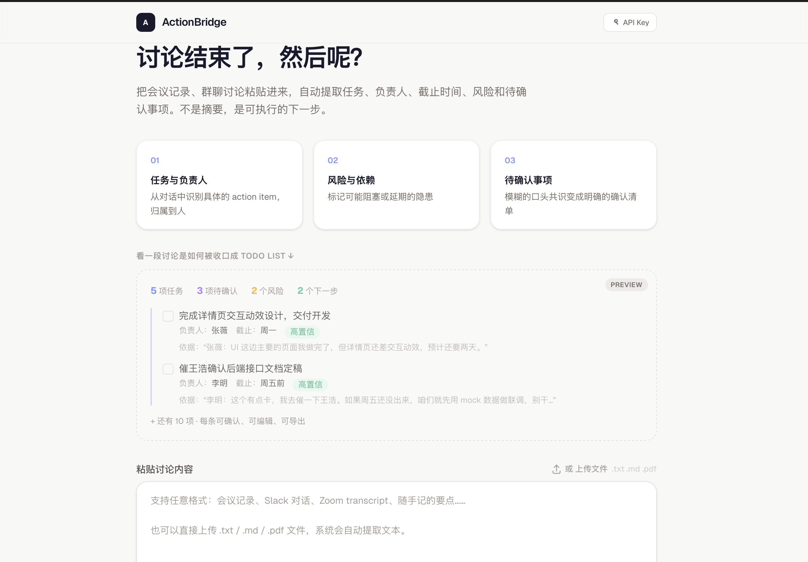
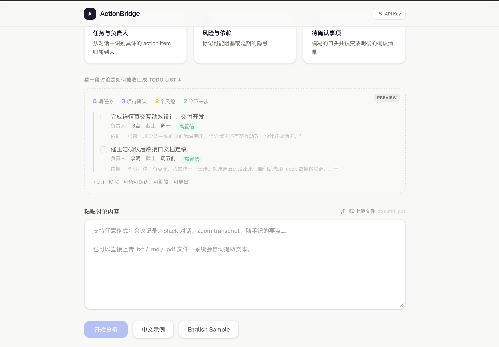
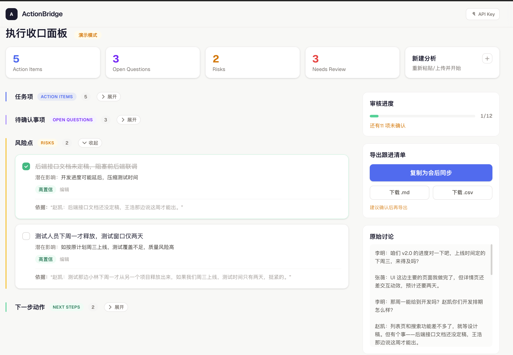

<!-- 顶部 banner -->
<div align="center">

# 🌉 ActionBridge

<p>
  
</p>

**AI execution closure assistant for small teams**
**讨论之后的执行收口闭环 · 不是会议摘要，而是把"聊完了"变成"可以分派的清单"**

<p>
  <a href="https://nextjs.org"></a>
  <a href="https://www.typescriptlang.org/"></a>
  <a href="https://tailwindcss.com"></a>
  <a href="https://react.dev"></a>
  <a href="./LICENSE"></a>
</p>

[**🌐 Live Demo**](https://actionbridge-ai-powered-production.up.railway.app) · [**🚀 Quick Start**](#-quick-start) · [**📋 Schema**](#-extraction-schema) · [**🎯 Design Decisions**](#-design-decisions)

</div>

---

## 🎯 Why ActionBridge?

> **Meetings end. Execution doesn't start.**

每个团队都有这个问题——讨论结束后，大家**以为**听懂了，
但实际上：任务没分配、截止没确认、风险提了就忘，
一周后才发现："我以为你在做。"

**ActionBridge 解决的就是这个断层。**

| ❌ 不是 | ✅ 是 |
|---|---|
| 会议摘要工具 | **执行收口助手** |
| 笔记应用 | "聊完了" → "可以执行"之间的那一步 |
| 协同平台 | 单次使用，粘贴 → 提取 → 审核 → 导出 |

---

## 📸 Screenshots

| Overview | Input | Result |
|---|---|---|
|  |  |  |

> One flow, three moments: **Paste/upload** discussion → **Extract** actionable follow-ups → **Review & export** a checklist your team can execute.

---

## ✨ Core Features

<table>
<tr>
<td width="50%" valign="top">

### 📋 Structured Extraction
Paste meeting notes, Slack threads, or Zoom transcripts. AI extracts 4 categories:
- **Action Items** — tasks with owners + deadlines
- **Open Questions** — agreed but not formally confirmed
- **Risks** — blockers and dependencies
- **Next Steps** — recommended immediate actions

### 🔍 Evidence-Based
Every extracted item cites the original text.
**No guessing** — verify each item traces back to what was actually said.

</td>
<td width="50%" valign="top">

### 🤝 Human-in-the-Loop
- **Confidence marking** (High / Medium / Low)
- **"待指定"** placeholder when AI can't determine owner/deadline
- **Inline editing** on every field
- **Confirm checkbox** + pre-export review hints

### 📤 Export & Share
- One-click **copy** for group chat
- Download **Markdown** follow-up checklist
- Download **CSV** for spreadsheets / Jira

</td>
</tr>
</table>

### 🔑 BYOK / Mock Mode
Works without an API key (mock data identical to real flow).
Click 🔑 in header to plug in **OpenAI / DeepSeek** — key stored only in browser localStorage.

---

## 🚀 Quick Start

```bash
# Try it live (no setup)
👉 https://actionbridge-ai-powered-production.up.railway.app

# Or run locally
git clone https://github.com/theAtlantic-zza/ActionBridge-AI-Powered.git
cd ActionBridge-AI-Powered
npm install
npm run dev
```

Open `http://localhost:3000`. Click **中文示例** or **English Sample** to see it in action.

<details>
<summary><b>🔧 Optional: connect your own model</b></summary>

**In-browser:** Click the 🔑 **API Key** button in the top-right corner.

**Via env:** Create `.env.local`:

```env
OPENAI_API_KEY=sk-your-key
OPENAI_BASE_URL=https://api.openai.com/v1
OPENAI_MODEL=gpt-5.4-pro
```

Any OpenAI-compatible API works (OpenAI, DeepSeek, custom endpoints).

</details>

---

## 📋 Extraction Schema

<details>
<summary><b>Click to expand TypeScript schema and design rationale</b></summary>

ActionBridge asks the model for a fixed, reviewable structure.
The UI is built around **explicit missing fields** (no guessing).

**Conceptual schema (every item):**
- `id` / `text` / `evidence` (source excerpt)
- `confidence` — `high` / `medium` / `low`
- `needsReview` — `true` when uncertain or incomplete

**Implementation (TypeScript):**

```ts
type Confidence = "high" | "medium" | "low";

type BaseItem = {
  id: string;
  description: string;
  sourceExcerpt: string;
  confidence: Confidence;
  confirmed: boolean;
};

type TaskItem         = BaseItem & { owner: string | null; deadline: string | null };
type ConfirmationItem = BaseItem & { relatedTo: string | null };
type RiskItem         = BaseItem & { impact: string };
type NextStepItem     = BaseItem & { owner: string | null; priority: "high" | "medium" | "low" };
```

**Design constraint:** missing `owner/deadline` stays explicit (`"待指定"` in UI) instead of being guessed.

</details>

---

## 🎯 Design Decisions

These are intentional product choices, not shortcuts.

| Decision | Why |
|---|---|
| **Evidence on every item** | Verify, don't blindly trust. |
| **Confidence marking** | Surface what AI is uncertain about. |
| **Human-in-the-loop** | AI proposes, humans decide. |
| **Explicit "待指定" placeholder** | AI admits when it doesn't know. |
| **Pre-export review hints** | Nudge users to confirm before sharing. |
| **No history, no accounts** | Single-use by design. |
| **Mock mode = real flow** | Demo experience identical to real one. |

<details>
<summary><b>🎬 Example Workflow（点击展开示例）</b></summary>

### Discussion snippet
```text
李明：这周 v2.0 的上线要定了，周三能上吗？
张薇：UI 主流程没问题，但详情页还差交互动效，估计还要两天。
赵凯：测试同学下周才释放，测试窗口可能只有两天，风险有点高。
李明：那详情页动效先降级？如果不影响主流程就先上。
张薇：可以，我今晚出个降级方案，明天给你确认。
```

### Structured output

**Action Items**
- `[A-1]` 输出「详情页动效降级方案」并评审 — 张薇 / 明天 / high confidence
- `[A-2]` 补齐回归测试清单并周一先跑一轮 — 赵凯 / 周一 / high confidence

**Open Questions**
- `[Q-1]` v2.0 是否按「主流程优先 + 动效降级」策略周三上线？ — needs review

**Risks**
- `[R-1]` 测试窗口仅两天，回归覆盖可能不足 — high

**Next Steps**
- `[N-1]` 明天确认降级方案后，冻结上线范围并同步群公告

> The point is not "what was said" but "what must happen next".

</details>

<details>
<summary><b>🧭 Why no voice / real-time transcription</b></summary>

Not because it's technically hard — but because it **changes the product's center of gravity**.

- This product focuses on **post-discussion execution closure**: review, evidence, confirmation, export.
- Real-time transcription shifts priority to **content capture** (latency, speaker diarization, integrations, storage, privacy) — a different product entirely.
- For this MVP, the highest ROI is tightening the closure loop via **file input → structured extraction → human review → export**.

</details>

---

## 🛠 Tech Stack & Architecture

| Layer | Tech |
|---|---|
| Framework | **Next.js 16** (App Router) |
| Language | **TypeScript** (strict) |
| Styling | **Tailwind CSS v4** |
| UI | **React 19**, hand-built components |
| AI | OpenAI-compatible API + structured JSON output |
| Export | Markdown, CSV |
| Deployment | Railway |

```
Input Phase ─→ Analyzing Phase ─→ Result Phase
(paste text)   (AI extraction)     (review, edit, confirm, export)
     │              │                    │
     ▼              ▼                    ▼
input-view     analyzing-view       result-view
                    │                ├── result-section (×4, color-coded)
                    ▼                ├── result-item (editable cards)
              API Route              └── export toolbar
              ├── User API Key
              ├── Env API Key
              └── Mock fallback
```

<details>
<summary><b>🗂 Project structure</b></summary>

```
src/
├── app/
│   ├── api/analyze/route.ts   → Analysis endpoint (LLM + mock fallback)
│   ├── page.tsx               → Single-page phase orchestrator
│   └── layout.tsx             → Root layout & metadata
├── components/
│   ├── input-view.tsx         → Input phase with sample buttons
│   ├── analyzing-view.tsx     → Loading state with rotating messages
│   ├── result-view.tsx        → Execution closure dashboard
│   ├── result-section.tsx     → Color-coded section containers
│   ├── result-item.tsx        → Editable item card with evidence
│   └── api-key-panel.tsx      → BYOK API key management
└── lib/
    ├── types.ts               → Core data schema
    ├── prompt.ts              → LLM system prompt design
    ├── mock-result.ts         → Demo data (Chinese + English)
    ├── sample-data.ts         → Sample discussion inputs
    └── export.ts              → Markdown / CSV export
```

</details>

---

## ❓ FAQ

**Is this a meeting summarizer?**
No. Summarizers compress information. ActionBridge extracts *actionable items* — tasks, owners, deadlines, risks — and makes them reviewable and editable.

**What if AI extracts something wrong?**
Every item is editable and shows its source text. Low-confidence items are flagged. The confirm checkbox exists precisely for this — nothing goes out without your review.

**Do I need an API key?**
No. Mock mode provides realistic demo data with the identical flow. Add a key only when you want to analyze your own discussions.

---

## 📄 License

[MIT](./LICENSE) © 2026 theAtlantic-zza

<div align="center">

---

**ActionBridge** — AI extracts, you decide.

If this project is useful, consider giving it a ⭐

</div>
